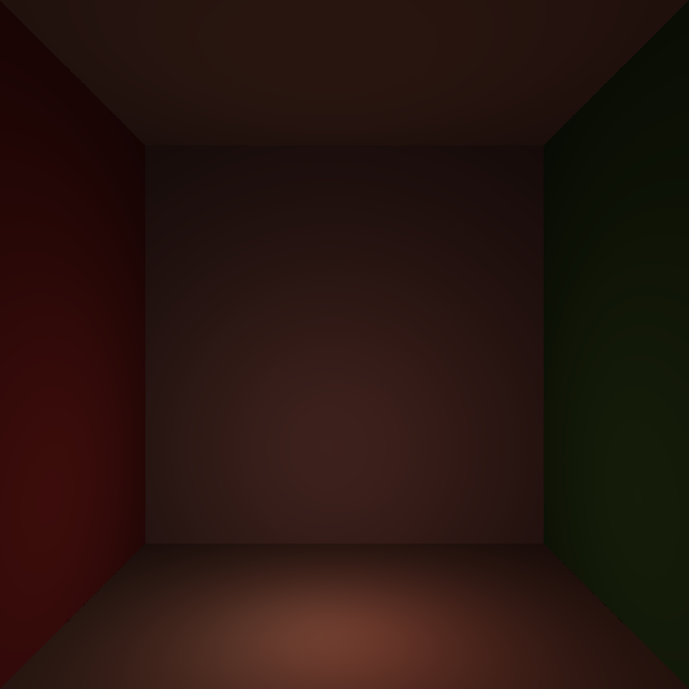

# Volumetric Path-tracer illuminated by million lights in CUDA

writing a volumetric path-tracer in CUDA C++

cluster instruction
```bash
sbatch gpu_job.slurm
```

</img>


```bash
cd nanovdb/nanovdb
rm -rf build
mkdir build
cd build

# Create the target directory first
mkdir -p /users/aagar133/.conda/envs/graphics/include/nanovdb

# Try with DESTDIR environment variable
DESTDIR=/users/aagar133/.conda/envs/graphics/include cmake .. \
    -DCMAKE_INSTALL_PREFIX="/nanovdb"

make -j$(nproc)
DESTDIR=/users/aagar133/.conda/envs/graphics/include make install
```